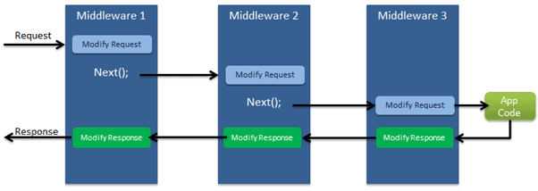
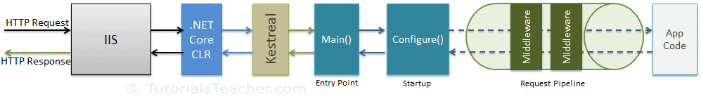
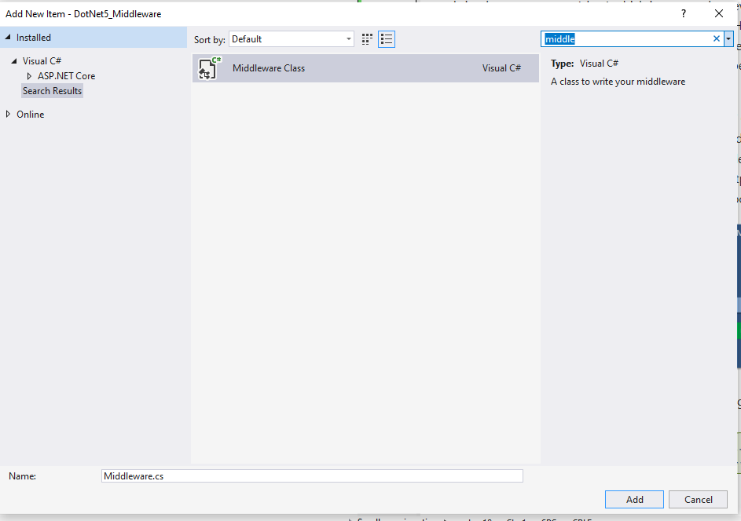
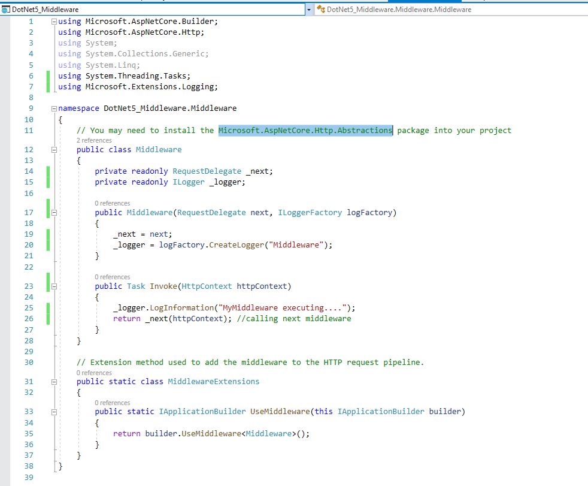
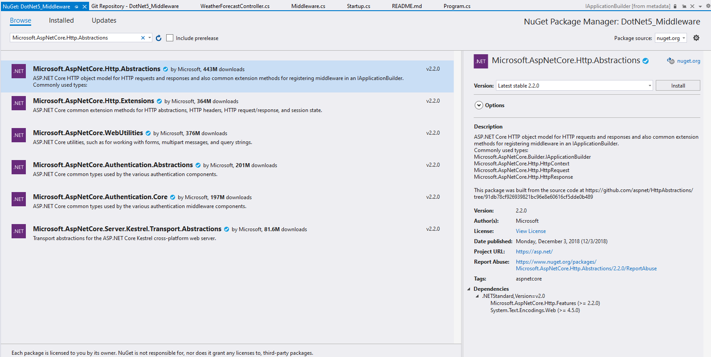
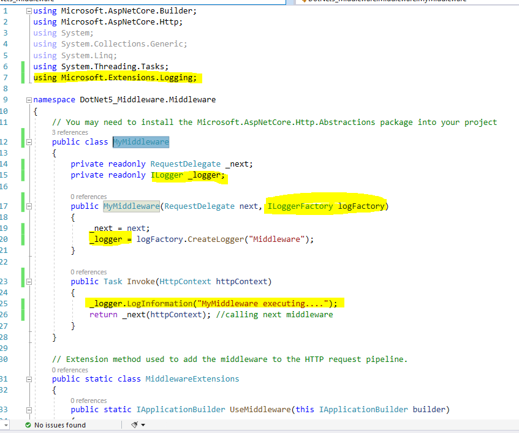
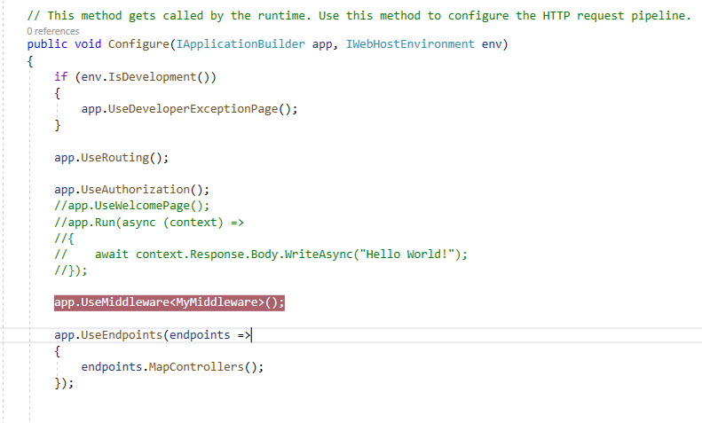
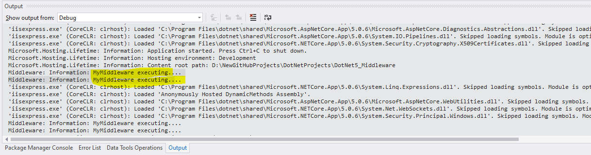

# DotNet5_Middleware
ASP.NET Core Middleware

ASP.NET Core has new concept called **Middleware **. A middleware is nothring bua conponenet(class) which is executed on every request in ASP.NET Core application. In the classic ASP.NET, HttpHandlers and HttpModules were part of request pipeline. Middleware is similar to HttpHandlers and HttpModules where both needs to be configures and excuted in each request.

Typically, there will be multiple middleware in ASP.NET Core web application. It can be either framework provided middleware, added via NuGet or your own custom middleware. We can se the order of middleware execution in the request pipeline. Each middleware adds or modifies http request and optionally passes control to the next middleware component.

Middleware build the request pipeline. The following figure illustrates the ASP.NET Core request processing.

How To Add Custom Middleware in ASP.NET Core Application

Add -> New Item -> middleware ->MyMiddleware.cs

Now we have to update the code as follows

Before running the project lets add a NuGet package manager as follows:

Make the changes in MyMiddleware class as follows:

Update Startup.cs class as follows to register custom middleware

Run the project and see the log in Debut windows

Middleware implemented successfully!!!